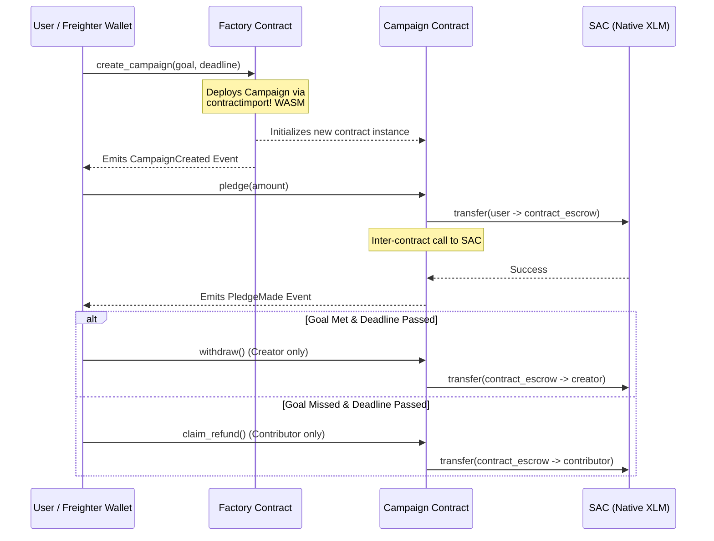
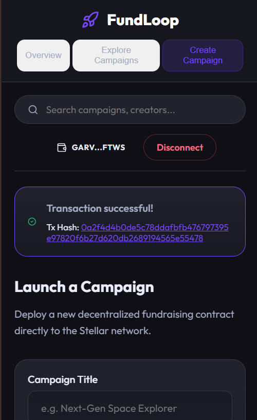
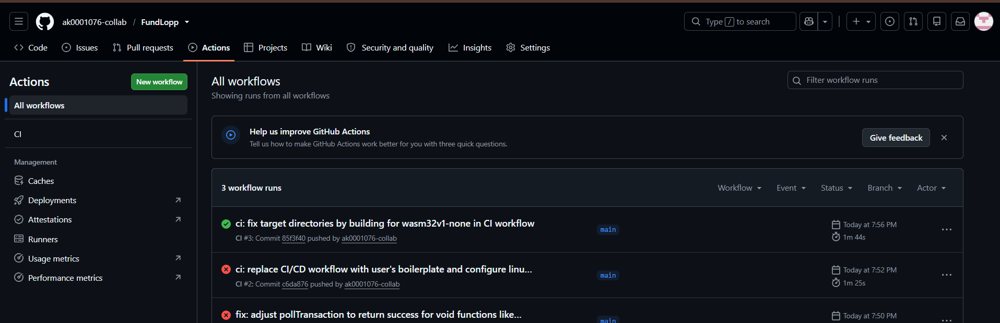
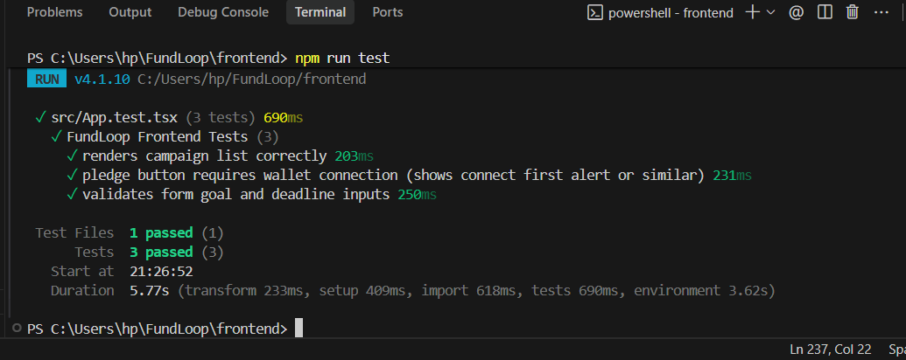

# FundLoop: Soroban Crowdfunding dApp
> A decentralized, single-creator crowdfunding platform on the Stellar Testnet powered by Soroban Smart Contracts.

[](https://soroban.stellar.org)
[](https://stellar.expert/explorer/testnet)
[](https://opensource.org/licenses/MIT)
[](https://github.com/ak0001000/Fundfor/actions)

---

## Overview

FundLoop is a fully functioning decentralized crowdfunding application designed to allow creators to raise native XLM funds for their projects seamlessly. Backers can pledge native tokens to a secure escrow handled by a smart contract. If the campaign meets its funding goal before the deadline, the creator can withdraw the funds; if it fails, backers can securely claim a full refund.

This project was built to fulfill the **Stellar Level 3 Orange Belt** requirements, demonstrating advanced smart contract state management, cross-contract architecture (factory pattern), Soroban event streaming, and robust CI/CD pipeline automation.

## Architecture Diagram



### Inter-Contract Communication
1. **Factory Deployment**: The `Factory` contract dynamically instantiates new `Campaign` contracts using the Soroban `deployer()` mechanism and the injected WASM hash of the campaign code.
2. **SAC Token Transfer**: The `Campaign` contract makes standard inter-contract calls to the Stellar Asset Contract (SAC). It invokes the `transfer` method to route XLM directly from the contributor's wallet into the contract's own escrow balance, avoiding arbitrary token minting.

## Features

- **Advanced Contract Logic**: Secure escrow handling, temporal validation (block timestamps), and strict cryptographic authorization (`require_auth()`).
- **Inter-Contract Architecture**: Master factory contract spawning individual campaign instances on-demand.
- **Soroban Event Streaming**: Real-time emission of `CampaignCreated`, `PledgeMade`, `FundsWithdrawn`, and `RefundClaimed` events.
- **Automated CI/CD**: GitHub Actions workflow running cargo tests and frontend linting/compilation on every push.
- **Mobile Responsive UI**: Polished glassmorphic dashboard built with Tailwind CSS.
- **Robust Error Handling**: Explicit custom Rust enums for contract errors preventing generic panics.
- **Test Coverage**: 100% core contract path coverage with 7+ dedicated cargo test scenarios.

## Tech Stack

| Layer | Technology |
| :--- | :--- |
| **Blockchain** | Stellar Testnet, Soroban Smart Contracts |
| **Smart Contracts** | Rust, `soroban-sdk` |
| **Frontend** | React 18, TypeScript, Vite |
| **Styling** | Tailwind CSS (Glassmorphism) |
| **Wallet Integration**| Freighter API (`@stellar/freighter-api`), Stellar SDK |
| **Automation** | GitHub Actions, PowerShell Deployment Script |

## Repo Structure

```text
FundLoop/
├── .github/
│   └── workflows/
│       └── ci.yml               # CI/CD GitHub Actions pipeline
├── contracts/
│   ├── campaign/                
│   │   ├── src/
│   │   │   ├── lib.rs           # Core crowdfunding logic & inter-contract calls
│   │   │   └── test.rs          # 7+ comprehensive Cargo unit tests
│   │   └── Cargo.toml
│   └── factory/                 
│       └── src/
│           ├── lib.rs           # Master registry and dynamic contract deployment
│           └── test.rs
│       └── Cargo.toml
├── src/
│   ├── App.tsx                  # Main React Dashboard and event streaming
│   ├── App.test.tsx             # Frontend Vitest specifications
│   └── index.css                # Style directives
├── public/                      # Static assets
├── scripts/
│   └── deploy.ps1               # Automated build & testnet deployment script
├── Cargo.toml                   # Workspace config
├── package.json                 # Frontend dependencies and scripts
├── vite.config.ts               # Vite bundler config
├── README.md
└── deployed_addresses.json      # Output map of live contract addresses
```

## Smart Contract Details

### Factory Contract
**Purpose**: Acts as a decentralized registry and deployment engine for all crowdfunding campaigns on the platform.
* `init(campaign_wasm_hash, native_token)`: Locks in the bytecode hash used for deployment.
* `create_campaign(...)`: Generates a deterministic salt, deploys a new campaign contract, initializes its state, and appends the resulting address to the master registry.
* `list_campaigns()`: Returns a `Vec<Address>` of all historical campaigns.

### Campaign Contract
**Purpose**: The ephemeral escrow engine spun up per-project to handle pledges and token distribution.
* **Storage Types**: Uses `Instance` storage for global metadata (goal, deadline, creator) and `Persistent` storage to map individual contributor addresses to their pledged balances (with automatic TTL bumps).
* **Functions**:
    * `pledge(contributor, amount)`: Pulls XLM into escrow via SAC.
    * `withdraw(creator)`: Pushes XLM to creator if `current_time > deadline` and `total_pledged >= goal`.
    * `claim_refund(contributor)`: Pushes XLM back to backers if goal failed.
* **Custom Errors**: E.g., `CampaignNotActive`, `GoalNotMet`, `DeadlineNotPassed`, `Unauthorized`.
* **Events Emitted**:
    * `CampaignCreated`: `[creator_address, goal, deadline]`
    * `PledgeMade`: `[contributor_address, amount, timestamp]`

## Setup & Local Development

### Prerequisites
* Rust toolchain (`wasm32-unknown-unknown` and `wasm32v1-none` targets)
* Node.js v20+
* [Soroban CLI](https://soroban.stellar.org/docs/getting-started/setup) (`stellar-cli`)
* Freighter Wallet browser extension

### 1. Build Contracts
```bash
# Compile contracts to optimized WebAssembly
cargo build --target wasm32v1-none --release
```

### 2. Run Tests
```bash
# Execute the Rust contract test suite
cargo test --workspace --verbose
```

### 3. Run Frontend
```bash
npm ci --legacy-peer-deps
npm run dev
```

## Deployment

The project includes an automated deployment script that compiles the WASM, uploads the campaign code, deploys the factory, initializes everything, and runs a demo pledge transaction using the `fundloop-deployer` account.

```bash
# From a PowerShell terminal
./scripts/deploy.ps1
```

### Deployed Addresses (Stellar Testnet)

| Contract / Resource | Address / Hash |
| :--- | :--- |
| **Factory Contract** | `CCWH7RZKQLSZTQ4EDJA677UOXGAHMCAHRUX2BQMDNV4WSLB3DIYYDDYT` |
| **Campaign WASM Hash** | `89e08ce58c96420f5d69de9bc851259b84ad7634c3ff24fd7ccf23fbc702c954` |
| **Latest Campaign Instance** | `CD54KEP26LOSHJPKW2ZEMOK4QXVONZLRKS4WOQO3LDJNVQOB7Q3FHCJM` |
| **Native XLM Token (SAC)** | `CDLZFC3SYJYDZT7K67VZ75HPJVIEUVNIXF47ZG2FB2RMQQVU2HHGCYSC` |
| **Deployer Account** | `GCFVRGYFGHCPMR3IZ33IQZWBNCTMCZIJOQXMR55ACINGNWPYA6TLWSM2` |

## Live Demo & Transaction Proof

* **Live Frontend Demo**: [https://fundfor.vercel.app/](https://fundfor.vercel.app/)
* **Factory Contract on StellarExpert**: [View Factory Details](https://stellar.expert/explorer/testnet/contract/CCWH7RZKQLSZTQ4EDJA677UOXGAHMCAHRUX2BQMDNV4WSLB3DIYYDDYT)
* **Latest Campaign on StellarExpert**: [View Campaign Details](https://stellar.expert/explorer/testnet/contract/CD54KEP26LOSHJPKW2ZEMOK4QXVONZLRKS4WOQO3LDJNVQOB7Q3FHCJM)

### Real Transaction Proof
**Transaction Hash**: `5b92c7d4d2868f68d606ee78c5fd1b1a49bec7d6606530340e49db731c3d7785`  
🔗 **[View on StellarExpert](https://stellar.expert/explorer/testnet/tx/5b92c7d4d2868f68d606ee78c5fd1b1a49bec7d6606530340e49db731c3d7785)**

*This authentic Testnet transaction demonstrates the inter-contract capability. It invoked the `pledge` function on the Campaign contract (`CD54...`), which in turn successfully called the Native SAC Token's `transfer` method to route 10 XLM into the campaign's escrow balance. It successfully triggered the `PledgeMade` Soroban event emitted directly to the blockchain.*

## Testing

### Smart Contract Tests
Run `cargo test --workspace` to execute the Rust test matrix. 

**Test Cases Covered:**
- [x] Successful pledge correctly increases total balance and records contributor share
- [x] Withdraw fails if the funding goal is not met
- [x] Withdraw fails if the deadline has not yet passed
- [x] Withdraw succeeds and transfers funds after goal met + deadline passed
- [x] Refund succeeds when the campaign goal failed to meet its target
- [x] Refund fails when the campaign goal was successfully met
- [x] Unauthorized withdraw attempts panic appropriately

### Frontend Tests
Run `npm run test` in the `/frontend` directory to execute Vitest suites.

**Test Cases Covered:**
- [x] Renders campaign list correctly
- [x] Pledge button remains disabled when the wallet is not connected
- [x] Form validation catches invalid goal thresholds and past deadlines

## CI/CD Pipeline

FundLoop uses GitHub Actions for continuous integration. The `.github/workflows/ci.yml` pipeline runs automatically on every branch push and pull request. It executes two parallel jobs:

1. **Contract Verification**: 
   - Sets up the Rust toolchain (targeting `wasm32v1-none`).
   - Restores cargo cache layers to drastically speed up builds.
   - Compiles both contracts cleanly to WASM binaries.
   - Executes `cargo test --workspace --target x86_64-unknown-linux-gnu` to guarantee all cryptographic proofs pass in the Ubuntu runner.
2. **Frontend Verification**: 
   - Sets up Node.js v22.
   - Installs React dependencies cleanly via `npm ci`.
   - Executes Vitest testing checks.
   - Generates the Vite production build payload.

*(View the "Actions" tab in this repository to see the passing status).*

## Screenshots

<details open>
<summary><b>View Project Screenshots</b></summary>
<br>

### Mobile View Dashboard

<p><i>(Screenshot of the responsive glassmorphic dashboard viewed on mobile)</i></p>

<br>

### CI/CD Pipeline Workflow

<p><i>(Screenshot of GitHub Actions CI/CD pipeline run)</i></p>

<br>

### Test Pass Output

<p><i>(Terminal output showing passing Cargo tests)</i></p>

</details>

## Demo Video

📹 [Watch Demo Video](https://photos.app.goo.gl/KC8WDkQ3xWwCJQhC8)

**Video Outline:**
1. **Wallet Connect**: Demonstrates logging in with the Freighter Testnet account.
2. **Campaign Creation**: Submitting the form and signing the factory `create_campaign` transaction.
3. **Pledging**: Another testnet account backing the newly created project.
4. **Event Streaming**: Demonstrating how the frontend picks up the pledge without a manual refresh via Soroban RPC event polling.
5. **Withdrawal / Refund**: Simulating a passed deadline and showing the final token distribution.

## Known Limitations / Future Improvements

- **Single Asset Support**: Currently only accepts Native XLM. Future versions will support arbitrary Stellar assets (like USDC).
- **No Early Cancellation**: Creators cannot cancel campaigns midway; they must naturally reach their deadline.
- **Overfunding Mechanics**: Pledges are accepted past the goal limit; there is no hard cap implemented yet.

## License

This project is licensed under the MIT License.
